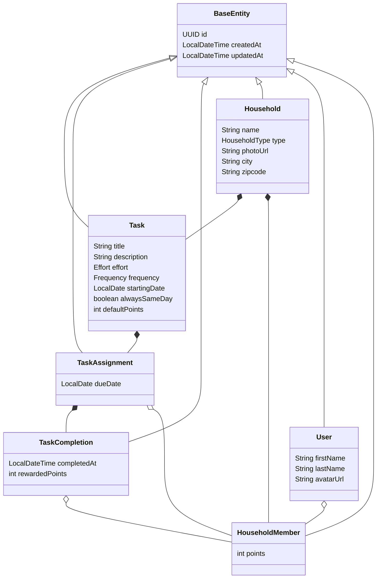

## Diagram

```mermaid
classDiagram
    BaseEntity <|-- Task
    BaseEntity <|-- TaskAssignment
    BaseEntity <|-- TaskCompletion
    BaseEntity <|-- Household
    BaseEntity <|-- User
    BaseEntity <|-- HouseholdMember
    Household  *-- Task
    Household *-- HouseholdMember
    User o-- HouseholdMember
    Task *-- TaskAssignment
    TaskAssignment *-- TaskCompletion
    TaskAssignment o-- HouseholdMember
    TaskCompletion o-- HouseholdMember

    
    class BaseEntity{
      UUID id
      LocalDateTime createdAt
      LocalDateTime updatedAt
    }
    class Task{
      String title
      String description
      Effort effort
      Frequency frequency
      LocalDate startingDate
      boolean alwaysSameDay
      int defaultPoints
    }
    class TaskAssignment{
        LocalDate dueDate
    }
    class TaskCompletion{
        LocalDateTime completedAt
        int rewardedPoints
    }
    class Household{
        String name
        HouseholdType type
        String photoUrl
        String city
        String zipcode
    }
    class User{
        String firstName
        String lastName
        String avatarUrl
    }
    class HouseholdMember{
        int points
    }
```
